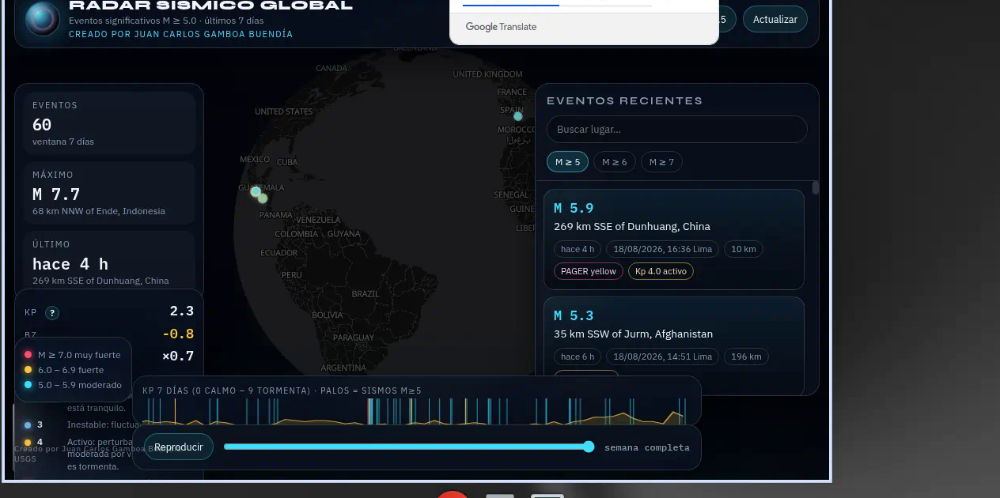

# Radar Sísmico Global

**[Abrir el visor →](https://juancarlosgamboabuendia.github.io/quake-radar-dashboard/)**

Live map of **M≥5** earthquakes (USGS, last 7 days) with NOAA planetary Kp. Spanish UI.

Mapa en vivo de los sismos **M ≥ 5.0** de los últimos **7 días**, con el índice magnético planetario **Kp** (NOAA) al lado.

Creado por **Juan Carlos Gamboa Buendía**.

## Qué estás viendo

Un visor a pantalla completa. El mapa es USGS. El panel de Kp / Bz es NOAA (viento solar).

| En el visor | Significa |
| --- | --- |
| Puntos cian / ámbar / rojo | Sismos M 5 / 6 / 7+ |
| Lista de la derecha | Los mismos eventos, hora de Lima |
| Kp | Qué tan inquieto está el campo magnético de la Tierra (0 calmo → 9 tormenta extrema) |
| Bz | Componente norte-sur del campo interplanetario, en vivo |
| Cruce | Cuántos sismos cayeron en ventanas Kp ≥ 4 vs. el azar de esa semana |

**Coincidencia no es pronóstico.** El Kp es planetario, no un precursor local. El único aviso que sí se puede vigilar: réplicas 72 h tras un M ≥ 6.5.

## Escala Kp

- **0–2** Calmo: el campo está tranquilo.
- **3** Inestable: fluctuaciones leves.
- **4** Activo: viento solar más fuerte de lo normal. Aún no es tormenta.
- **5–9** Tormenta geomagnética, de menor (G1) a extrema (G5).

## Datos

- Sismos: [USGS Earthquake Hazards Program](https://earthquake.usgs.gov/) (feed 4.5_week, filtro M ≥ 5).
- Campo: [NOAA SWPC](https://www.swpc.noaa.gov/) (Kp planetario 7 días, Kp estimado y IMF Bz en vivo).
- Se actualiza solo cada 5 minutos. Alertas de sonido solo para sismos **nuevos** M ≥ 6.5.

## En el celular

La lista sale plegada (tócala en **Eventos**). **Kp** abre la escala. En Perú, el botón **Perú** centra el mapa.

## Archivos

- `index.html` — el visor (GitHub Pages lo sirve en la raíz).
- `quake-radar-dashboard.html` — la misma app, para abrirla en local.

No hace falta instalar nada: abre el visor en el enlace de arriba, o baja `index.html` y ábrelo en el navegador.
